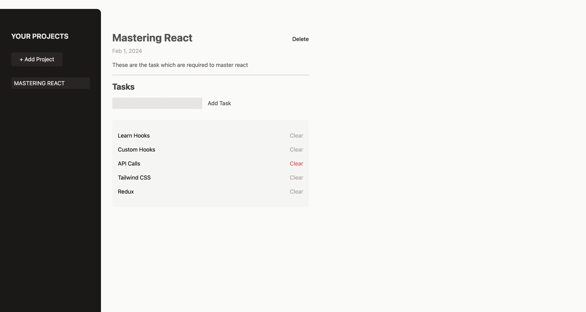
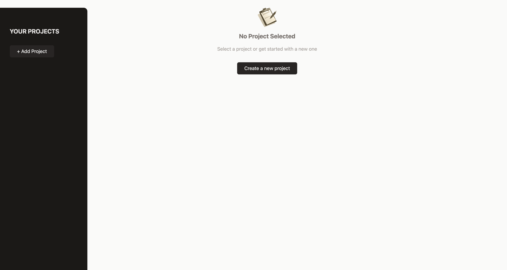

# Project and Task Management Website

This is a simple project and task management website built using React and styled with Tailwind CSS. The website allows users to add projects with titles, descriptions, and due dates. Within each project, users can add, view, and delete tasks.

## Features

- **Create Projects:** Add new projects with titles, descriptions, and due dates.
- **Manage Tasks:** Within each project, add, view, and delete tasks.
- **Delete Projects:** Remove entire projects when they are no longer needed.

## Technologies Used

- React
- Tailwind CSS

## Getting Started

### Prerequisites

Make sure you have [Node.js](https://nodejs.org/) and [npm](https://www.npmjs.com/) installed on your machine.


 ### Installing

1. Clone the repository to your local machine:

    ```bash
    git clone https://github.com/sehaj23/investment-calculator.git
    ```

2. Navigate to the project directory:

    ```bash
    cd investment-calculator-react
    ```

3. Install dependencies:

    ```bash
    npm install
    ```

### Running the App

1. Start the development server:

    ```bash
    npm run dev
    ```

2. Open your browser and go to [http://localhost:5173](http://localhost:5173)


   ### Open your browser and visit http://localhost:5173/ to view the application.

## Usage
    Create a Project:

    Click on the "Add Project" button.
    Fill in the project details, including title, description, and due date.
    Click "Save" to create the project.
    Manage Tasks:

    Inside a project, use the "Add Task" button to add new tasks.
    Tasks are displayed with their text.
    To delete a task, use the clear button next to the task.
    Delete Projects:
    To delete an entire project, use the delete button in the project view.

 ## Contributing

Feel free to contribute to the project. Create a pull request, and we'll review it together.

## License

No License.

## Screenshots




   
